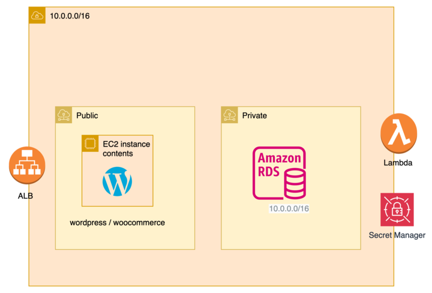

# Welcome to the CDK TypeScript Project for BMO

This CDK project is designed to create a secure, three-tier application architecture for BMO with the end goal of deploying WordPress, along with extra plugins, in a robust and secure environment. Utilizing the AWS Cloud Development Kit (CDK) with TypeScript, this project facilitates the setup of various AWS services to ensure a secure and efficient deployment.

The architecture involves setting up Application Load Balancers (ALB), EC2 instances, carefully configured security groups, AWS Secrets Manager, and AWS Lambda to create a comprehensive and secure environment for the WordPress application. The ALB acts as the entry point for traffic, directing users to the appropriate EC2 instances where the WordPress application is hosted. Security groups are employed to tightly control access to these resources, ensuring that only legitimate traffic can reach the application layers.

## Enhanced Security

- **AWS Secrets Manager:** This project leverages AWS Secrets Manager to securely store and manage database credentials. By utilizing Secrets Manager, we ensure that sensitive information such as database passwords are encrypted and accessed securely by authorized services only, minimizing the risk of credential exposure.

- **AWS Lambda for Database Provisioning:** To automate the process of user and database creation on RDS (Relational Database Service), AWS Lambda functions are employed. These Lambda functions are triggered during the deployment process to provision the necessary database resources and configure them for WordPress, streamlining the setup process and ensuring consistency across deployments.

## Project Goals

- **Deploy WordPress with Additional Plugins:** Automate the deployment of WordPress along with selected extra plugins, ensuring a seamless setup process and integration.
- **Ensure a Secure Setup:** Utilize ALBs, EC2 instances, and security groups to architect a secure environment that protects against unauthorized access and potential threats.
- **Scalable and Maintainable:** Leverage AWS CDK to create an infrastructure that is not only secure but also scalable and easy to maintain over time.

## Useful Commands

- `npm run build` - Compile TypeScript to JavaScript, preparing the code for deployment.
- `npm run watch` - Monitor for any changes in the TypeScript code and compile it automatically, aiding in development.
- `npm run test` - Perform the Jest unit tests to ensure code quality and functionality.
- `npx cdk deploy` - Deploy this stack to your default AWS account/region, setting up the infrastructure in the cloud.
- `npx cdk diff` - Compare the currently deployed stack with the current state to identify changes.
- `npx cdk synth` - Emit the synthesized CloudFormation template, providing a blueprint of the cloud resources to be deployed.

The `cdk.json` file tells the CDK Toolkit how to execute your app, serving as the backbone for the deployment process. By following this setup, BMO can achieve a secure and efficient deployment of WordPress, benefiting from the scalability and robustness of AWS infrastructure.
